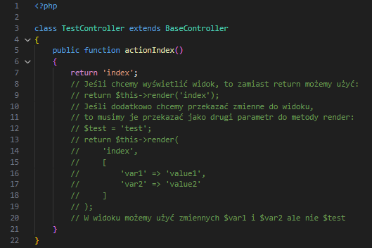
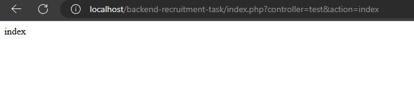
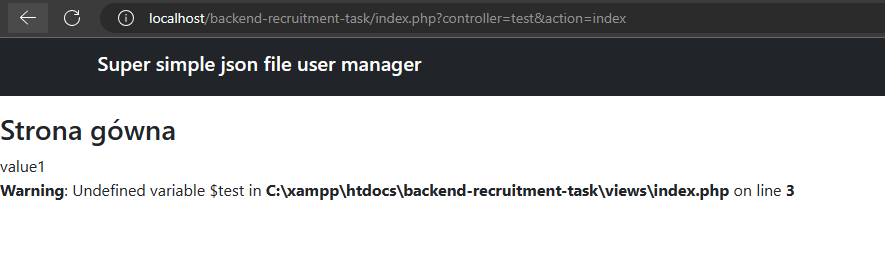

# Zadanie rekrutacyjne

Zrobiłem prostą aplikację wyświetlającą wszystkich użytkowników z pliku z możliwością ich dodania i usunięcia. Formularz dodawania użytkownika wyświetla się w modalu którego zawartość jest ładowana dopiero po klinkięciu przycisku dodawania użytkownika.

# Framework

Na potrzeby tego zadania zrobiłem prosty framework MVC. Robiąc go wzorowałem się na frameworku YII2 dzięki czemu modele i kontrolery ładują się automatycznie i możemy szybko dodać stronę np.



Wyświetlona strona:



Przy zakomentowanym przykładzie z parametrami strona będzie wyglądać tak:



Strona dzięki użyciu metody render, wyświetla się ona w głównym szablonie strony.

Obsługa modeli przypomina trochę ORM. Przypiesza to pracę z danymi. Dzięki nim można łatwo dodać paginację lub sortowanie.

Pracowałem nad tym tylko dwa dni więc nie jest to jeszcze pełnoprawny framework. Przykładowo system walidacji formularzy jest dodany ale nie posiada tylko funkcje sprawdzania czy dany atrybut jest wymagany i czy jest to email. Niezależnie od tego jest on zrobiony w taki sposób że można go łatwo rozszerzyć o nowe funkcje.

# Backend/Full-stack recruitment task

----


Hello there! we can't wait to see to you on board 🚀

We will kindly ask you to take a look at this super simple recruitment task that will give us a lot of information about your skills with little effort on side. 


### 📋   Requirements

- PHP server (>= 8.0) 
  Really, that's all you need 🙂


### ⚙️File structure

```
│   index.php
├───assets
│   ├───css
│   │       styles.css
│   └───js
│           script.js
├───dataset
│       users.json
└───partials
        main.php
```

- Your entry file for PHP is `main.php` - feel free to organize other PHP files just the way you like it
- Your datasource is `users.json` file - all changes (see points 2 and 3) have to be saved
- For scripts and styles, use the `styles.scss` and `script.js` files - those are not necessary, but we will highly appreciate it 


### 💻   Your task 

The recruitment task consists of 3 steps

1️⃣ Create a simple table which lists the users from `users.json` file

| Name             | Username  | Email              | Address                                     | Phone                 | Company            |
| ---------------- | --------- | ------------------ | ------------------------------------------- | --------------------- | ------------------ |
| Leanne Graham    | Bret      | Sincere@april.biz  | Kulas Light, 92998-3874 Gwenborough         | 1-770-736-8031 x56442 | Romaguera-Crona    |
| Ervin Howell     | Antonette | Shanna@melissa.ts  | Victor Plains, 90566-7771 Wisokyburgh       | 010-692-6593 x09125   | Deckow-Crist       |
| Clementine Bauch | Samantha  | Nathan@yesenia.ner | Douglas Extension, 59590-4157 McKenziehaven | 1-463-123-4447        | Romaguera-Jacobson |

2️⃣ Add a "Remove" button for each row, once clicked - the selected user should be removed from the JSON file, the page should be reloaded after the button is clicked. 

| Name             | Username  | Email              | Address                                     | Phone                 | Company            |                   |
| ---------------- | --------- | ------------------ | ------------------------------------------- | --------------------- | ------------------ | ----------------- |
| Leanne Graham    | Bret      | Sincere@april.biz  | Kulas Light, 92998-3874 Gwenborough         | 1-770-736-8031 x56442 | Romaguera-Crona    | **REMOVE BUTTON** |
| Ervin Howell     | Antonette | Shanna@melissa.ts  | Victor Plains, 90566-7771 Wisokyburgh       | 010-692-6593 x09125   | Deckow-Crist       | **REMOVE BUTTON** |
| Clementine Bauch | Samantha  | Nathan@yesenia.ner | Douglas Extension, 59590-4157 McKenziehaven | 1-463-123-4447        | Romaguera-Jacobson | **REMOVE BUTTON** |

3️⃣ Add a simple form for adding a new user to the JSON file. 

| Name             | Username  | Email              | Address                                     | Phone                 | Company            |                   |
| ---------------- | --------- | ------------------ | ------------------------------------------- | --------------------- | ------------------ | ----------------- |
| Leanne Graham    | Bret      | Sincere@april.biz  | Kulas Light, 92998-3874 Gwenborough         | 1-770-736-8031 x56442 | Romaguera-Crona    | **REMOVE BUTTON** |
| Ervin Howell     | Antonette | Shanna@melissa.ts  | Victor Plains, 90566-7771 Wisokyburgh       | 010-692-6593 x09125   | Deckow-Crist       | **REMOVE BUTTON** |
| Clementine Bauch | Samantha  | Nathan@yesenia.ner | Douglas Extension, 59590-4157 McKenziehaven | 1-463-123-4447        | Romaguera-Jacobson | **REMOVE BUTTON** |

**Name input** | **Username input** | **Email input** | **Address input** | **Phone Input**	| **Company Input** | **SUBMIT BUTTON**

---


⚠️You have a free reign in terms of the architecture - creating controllers and models will be a huge plus

⚠️We don't insist on fancy styling for the table, but anything else than the raw layout will be appreciated

⚠️We will check aspects like code readability, scalability and error handling

⏳ Don't hurry up! Take as much time as you need


⚠️The easiest way to start is to fork this repository, but feel free to use any other method

Good luck ! 🔥
